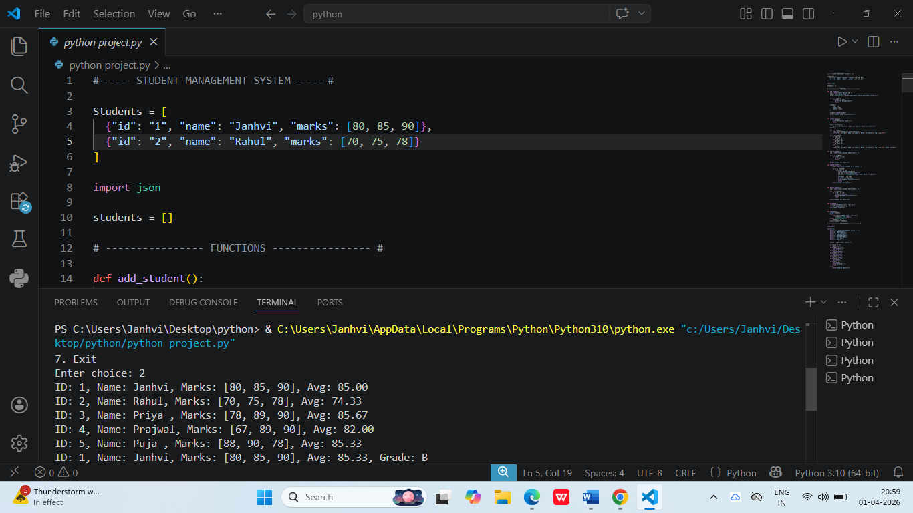

Student Management System (Python)
📌 Project Overview
This project is a robust, command-line application designed to manage student records efficiently. It was developed to demonstrate core Object-Oriented Programming (OOP) concepts and persistent data storage using File Handling in Python. This project serves as a foundational tool for tracking academic data and student demographics.

🚀 Key Features
Create & Manage Records: Add new student profiles with unique IDs, names, and grades.

Data Persistence: Uses File Handling to save data permanently, ensuring records are not lost when the program closes.

Search & Filter: Quickly locate specific student records by ID or Name.

Update & Delete: Modify existing student information or remove records from the database.

Data Validation: Ensures all inputs (like grades and IDs) follow the correct format to prevent errors.

🛠️ Technologies Used
Language: Python 3.x

Concepts: Object-Oriented Programming (Classes, Objects, Methods), Exception Handling.

Data Storage: File Handling (TXT/CSV).

Libraries: NumPy (used for basic statistical analysis of grades).

📊 Sample Output

📂 Project Structure
Plaintext
├── main.py              # The entry point of the application
├── student_manager.py   # Contains the Class logic and Methods
├── students_data.txt    # The database file where records are stored
└── README.md            # Project documentation
